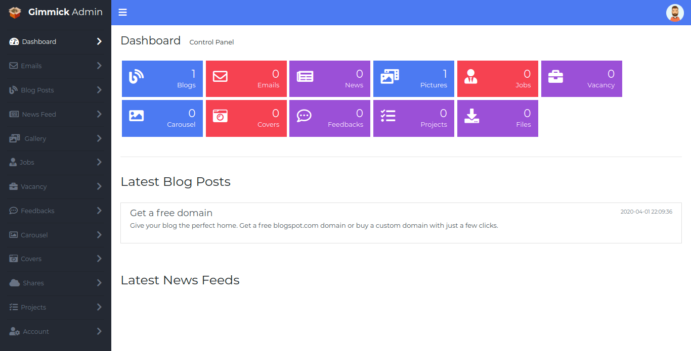
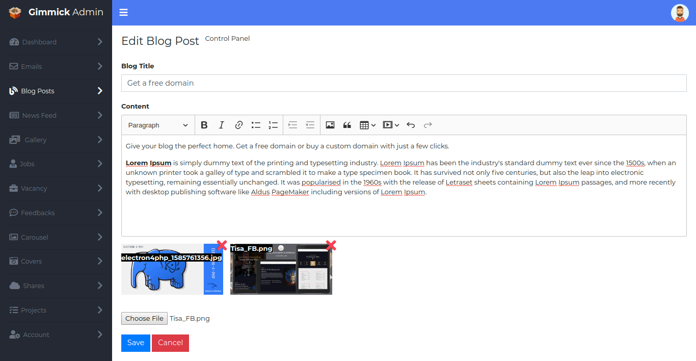
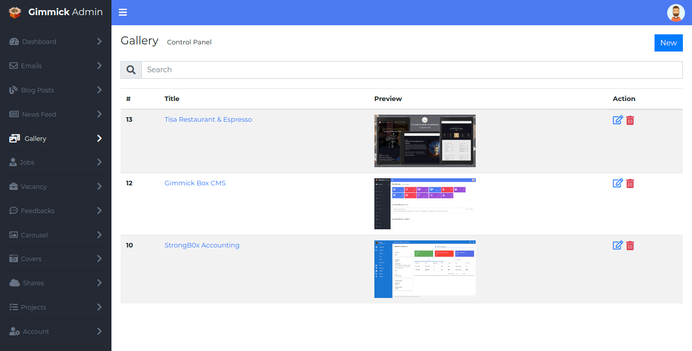

### CMS-PHP

<table>
	<tr>
		<td></td>
		<td>
		<tr>
		<tr>
		<td></td>
		</tr>
	</tr>
</table>


```
a2enmod rewrite
```

/etc/apache2/sites-enabled/000-default.conf
```
<Directory /var/www/html>
    AllowOverride All
 </Directory>
```

```
chmod +w /public/images
```
app/config/config.php
```
<?php
define("HOME", dirname(dirname(dirname(__FILE__))) . "/public");
define("SITE", "CMS");
define("URL", "http://127.0.0.1/cms-php");
define("APP", dirname(dirname(__FILE__)));
define("HOST", "localhost");
define("PORT", 3306);
define("USER", "root");
define("PASSWORD", "");
define("DATABASE", "cms");

define("HOSTMASTER", "kritish.dhaubanjar@gmail.com");
define("FROM", "info@continentalhrd.com");
```

public/.htaccess
```
<IfModule mod_rewrite.c>
    Options -Multiviews
    RewriteEngine On
    RewriteBase /cms-php/public
    RewriteCond %{REQUEST_FILENAME} !-d
    RewriteCond %{REQUEST_FILENAME} !-f
    RewriteRule ^(.+)$ index.php?url=$1 [QSA,L]
</IfModule>
```
